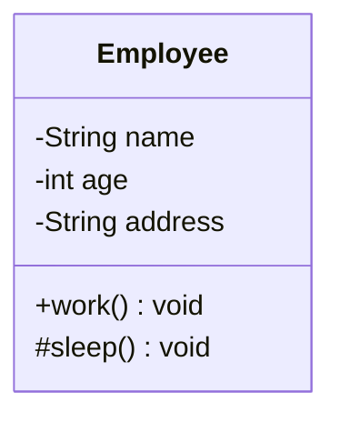
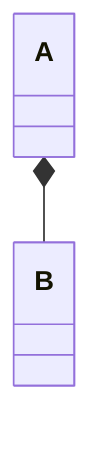
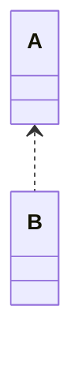
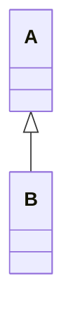
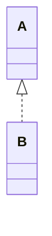
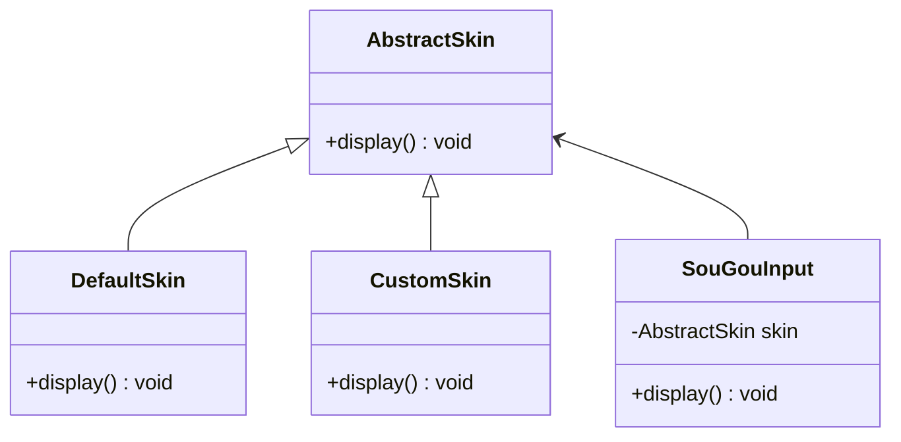

# 设计模式（Java）
## 一、UML图
在软件工程中，统一建模语言（UML）中的类图是一种静态结构图，它通过显示系统的类，其属性，操作（或方法）以及对象之间的关系来描述系统的结构。
[使用mermaid绘制UML图](http://www.manongjc.com/detail/24-uliwhbrlcdrdqnw.html)
### 1、类的表示方式
UML类图使用包含类名、属性(field)和方法(method)且带有分割线的矩形来表示

属性、方法名前加"+"、"-"和"#"表示可见性，UML类图中表示可见性的符号有三种：
- +：表示public
- -：表示private
- \#：protected

备注：什么都不加表示default

### 2、类与类之间的关系
#### a、关联关系
对象间的一种引用关系，用于表示一类对象与另一类对象之间的联系。分为一般关联关系、聚合关系和组合关系
- 一般关联关系
  - 单向关联  
  用一个带实心箭头的实线表示，最常见的为成员属性
  ```mermaid
  classDiagram
    Address <-- Customer
    Customer: -Address address 
  ```
  - 双向关联  
  双方各自持有对方类型的成员变量，使用一条不带任何箭头的直线表示
  ```mermaid
  classDiagram
  Customer -- Product
  Customer: -List~product~ products
  Product: -Customer customer
  ```
  - 自关联
  使用一条带有箭头且指向自身的线表示
  ```mermaid
  classDiagram
  Node --> Node
  Node: -Node next
  ```
- 聚合关系

- 组合关系

#### b、依赖关系

#### c、继承关系

#### d、实现关系

## 二、软件设计原则
### 1、开闭原则  
**对修改关闭，对扩展开放**  
最常见的就是定义接口（或抽象类），使用子类实现（或继承）来扩展功能。举例：搜狗输入法皮肤案例


## 三、设计模式
分类：
- **创建型模式**（5种）：用于描述怎样创建对象，主要特点是：将对象的创建与使用分离
  - 单例模式
  - 原型模式
  - 工厂方法模式
  - 抽象工厂模式
  - 建造者模式
- **结构型模式**（7种）：用于描述如何将类或对象按某种布局组成更大的结构
  - 代理模式
  - 适配器模式
  - 桥接模式
  - 装饰者模式
  - 外观模式
  - 享元模式
  - 组合模式
- **行为型模式**（11种）：用于描述类或对象之间怎样相互协作，共同完成单个对象无法单独完成的任务，以及怎样分配职责
  - 模板方法模式
  - 策略模式
  - 命令模式
  - 责任链模式
  - 状态模式
  - 观察者模式
  - 中介者模式
  - 迭代器模式
  - 访问者模式
  - 备忘录模式
  - 解释器模式