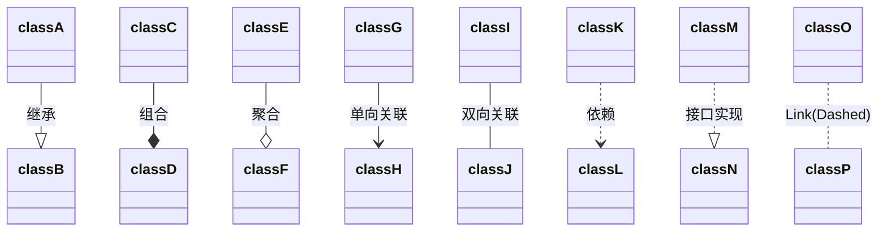
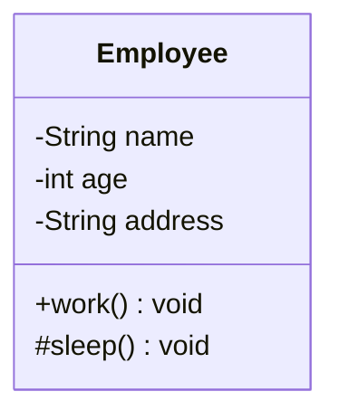
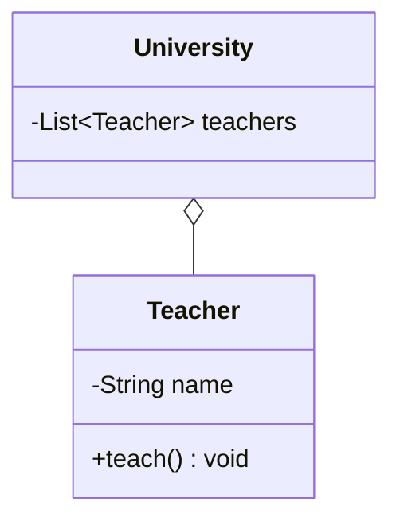
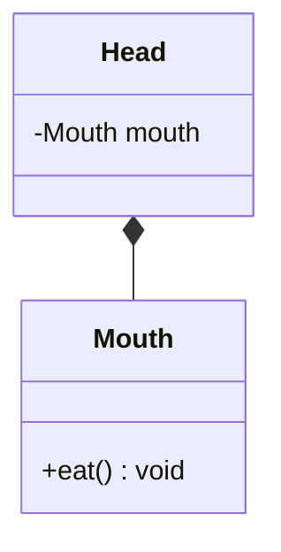
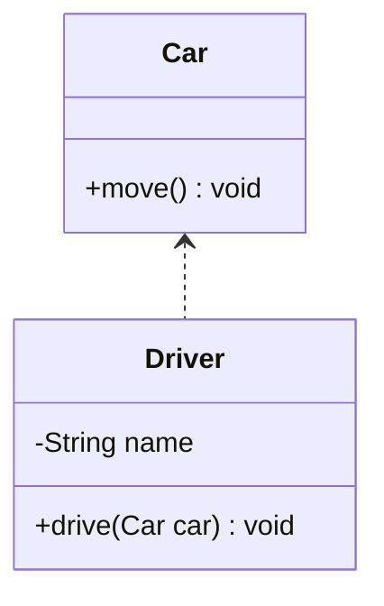
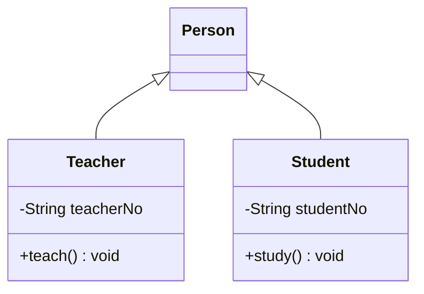
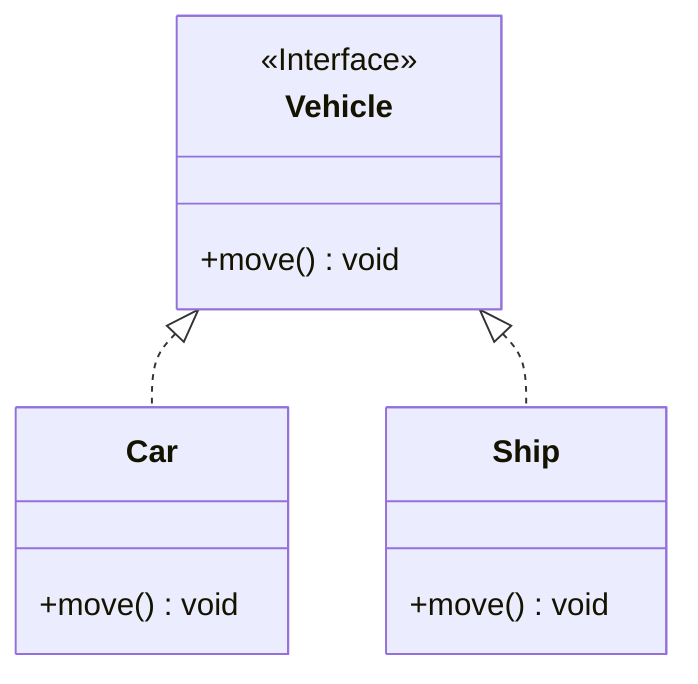
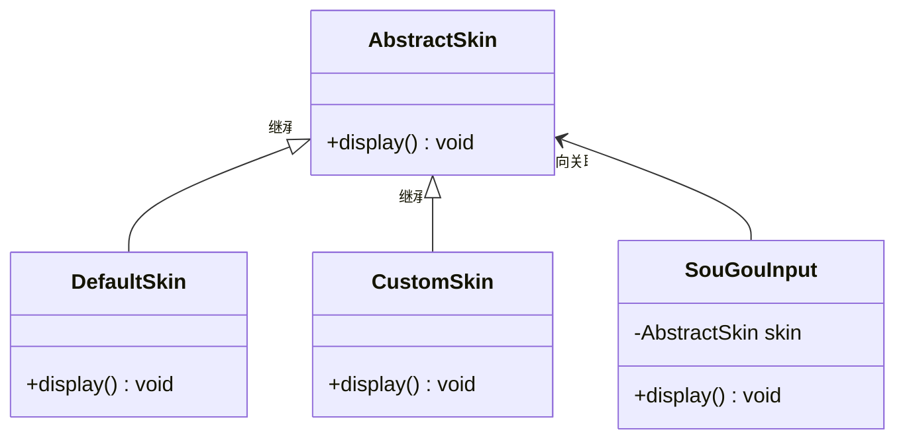

# 设计模式（Java）

## 一、UML图

在软件工程中，统一建模语言（UML）中的类图是一种静态结构图，它通过显示系统的类，其属性，操作（或方法）以及对象之间的关系来描述系统的结构。
[使用mermaid绘制UML图](https://www.cnblogs.com/mybdss/p/14958781.html)

|       |               |          |                                                              |
| :---- | :------------ | :------- | ------------------------------------------------------------ |
| 描述  | 描述          | 说明     |                                                              |
| <\|-- | Inheritance   | 继承     | 一般而言，如果类A扩展类B,类A不但包含从类B继承的方法，还会拥有一些额外的功能。 |
| *--   | Composition   | 组合     |                                                              |
| o--   | Aggregation   | 聚合     | 聚合关系意味着类A 的对象包含类B 的对象。                     |
| -->   | Association   | 单向关联 |                                                              |
| --    | Link (Solid)  | 双向关联 |                                                              |
| ..>   | Dependency    | 依赖     | 如果一个类的方法操纵另一个类的对象， 我们就说一个类依赖于另一个类。 |
| ..\|> | Realization   | 实现     |                                                              |
| ..    | Link (Dashed) |          |                                                              |



###  1、类的表示方式

UML类图使用包含类名、属性(field)和方法(method)且带有分割线的矩形来表示



属性、方法名前加"+"、"-"和"#"表示可见性，UML类图中表示可见性的符号有三种：

- +：表示public
- -：表示private
- \#：protected

备注：什么都不加表示default

### 2、类与类之间的关系

#### a、关联关系

对象间的一种引用关系，用于表示一类对象与另一类对象之间的联系，一般以成员属性的形式体现。分为一般关联关系、聚合关系和组合关系

- 一般关联关系
    - 单向关联  
      **用一个带实心箭头的实线表示**
  ```mermaid
  classDiagram
    Address <-- Customer
    Customer: -Address address 
  ```
    - 双向关联  
      双方各自持有对方类型的成员变量，使用**一条不带任何箭头的直线表示**
  ```mermaid
  classDiagram
  Customer -- Product
  class Customer {
    -List~product~ products
  }
  class Product {
    -Customer customer
  }
  ```
    - 自关联
      **使用一条带有箭头且指向自身的线表示**
  ```mermaid
  classDiagram
  Node --> Node
  Node: -Node next
  ```
- 聚合关系  
  聚合关系是关联关系的一种，是强关联关系，是整体与部分之间的关系，但是部分可脱离整体对象而独立存在。
  **用带空心菱形的实线来表示，菱形指向整体**



- 组合关系  
  组合关系也表示整体与部分之间的关系，但是是一种更强烈的聚合关系——组合关系中，整体对象可以控制部分对象的生命周期，一旦整体对象不存在，部分对象也将不存在，部分对象不能脱离整体对象而存在  
  **用带空心菱形的实线来表示，菱形指向整体**



#### b、依赖关系

依赖关系是一种使用关系，是对象之间耦合度最弱的一种关联关系，是临时性的关联。具体表现：某个类的方法通过局部变量、方法的参数或者对静态方法的调用来访问另一个类（被依赖的类）中的某些方法来完成一些职责  
**使用带箭头的虚线来表示，箭头从使用类指向被依赖的类**



#### c、继承关系

继承关系是对象之间耦合度最大的一种关系，表示一般与特殊的关系，是父类与子类之间的关系，是一种继承关系（也称为泛化关系）  
**用带空心三角箭头的实线来表示**，箭头从子类指向父类



#### d、实现关系

实现关系是接口与实现类之间的关系。类实现了接口，类中的操作实现了接口中所声明的所有抽象操作  
**用带空心三角箭头的虚线来表示**，箭头从实现类指向接口



## 二、软件设计原则

### 1、开闭原则

**对修改关闭，对扩展开放**  
在程序需要进行扩展时，不能修改原有的代码，实现一个热插拔的效果。简言之，是为了使程序的扩展性好，易于维护和升级。 最常见的就是定义接口（或抽象类），使用子类实现（或继承）来扩展功能。举例：搜狗输入法皮肤案例



``` java
/**
 * @author ZhangTao
 * @date 2022/6/21
 * @desc 抽象皮肤类
 */
public abstract class AbstractSkin {

    /**
     * 显示的方法
     */
    public abstract void display();

}
```

``` java
/**
 * @author ZhangTao
 * @date 2022/6/21
 * @desc 自定义皮肤
 */
public class CustomSkin extends AbstractSkin {

    @Override
    public void display() {
        System.out.println("自定义皮肤实现...");
    }
}
```

``` java
/**
 * @author ZhangTao
 * @date 2022/6/21
 * @desc 默认皮肤类
 */
public class DefaultSkin extends AbstractSkin {

    @Override
    public void display() {
        System.out.println("默认皮肤实现...");
    }
}
```

``` java
/**
 * @author ZhangTao
 * @date 2022/6/21
 * @desc 搜狗输入法皮肤类
 */
public class SouGouInput {

    private AbstractSkin skin;

    /**
     * 显示方法
     */
    public void display() {
        skin.display();
    }

}
```

```java
/**
 * @author ZhangTao
 * @date 2022/6/21
 * @desc
 */
public class SkinClient {

    public static void main(String[] args) {
        // 1、创建搜狗输入法对象
        SouGouInput input = new SouGouInput();
        
        // 2、创建皮肤对象
        // DefaultSkin skin = new DefaultSkin();
        CustomSkin skin = new CustomSkin();
        
        // 3、设置皮肤对象到输入法
        input.setSkin(skin);
        
        // 4、显示皮肤
        input.display();
    }

}
```

## 三、设计模式

分类：

- **创建型模式**（5种）：用于描述怎样创建对象，主要特点是：将对象的创建与使用分离
    - 单例模式
    - 原型模式
    - 工厂方法模式
    - 抽象工厂模式
    - 建造者模式
- **结构型模式**（7种）：用于描述如何将类或对象按某种布局组成更大的结构
    - 代理模式
    - 适配器模式
    - 桥接模式
    - 装饰者模式
    - 外观模式
    - 享元模式
    - 组合模式
- **行为型模式**（11种）：用于描述类或对象之间怎样相互协作，共同完成单个对象无法单独完成的任务，以及怎样分配职责
    - 模板方法模式
    - 策略模式
    - 命令模式
    - 责任链模式
    - 状态模式
    - 观察者模式
    - 中介者模式
    - 迭代器模式
    - 访问者模式
    - 备忘录模式
    - 解释器模式