# 设计模式（Java）

## 一、UML图

在软件工程中，统一建模语言（UML）中的类图是一种静态结构图，它通过显示系统的类，其属性，操作（或方法）以及对象之间的关系来描述系统的结构。
[使用mermaid绘制UML图](https://www.cnblogs.com/mybdss/p/14958781.html)

|       |               |          |                                                              |
| :---- | :------------ | :------- | ------------------------------------------------------------ |
| 描述  | 描述          | 说明     |                                                              |
| <\|-- | Inheritance   | 继承     | 一般而言，如果类A扩展类B,类A不但包含从类B继承的方法，还会拥有一些额外的功能。 |
| *--   | Composition   | 组合     |                                                              |
| o--   | Aggregation   | 聚合     | 聚合关系意味着类A 的对象包含类B 的对象。                     |
| -->   | Association   | 单向关联 |                                                              |
| --    | Link (Solid)  | 双向关联 |                                                              |
| ..>   | Dependency    | 依赖     | 如果一个类的方法操纵另一个类的对象， 我们就说一个类依赖于另一个类。 |
| ..\|> | Realization   | 实现     |                                                              |
| ..    | Link (Dashed) |          |                                                              |

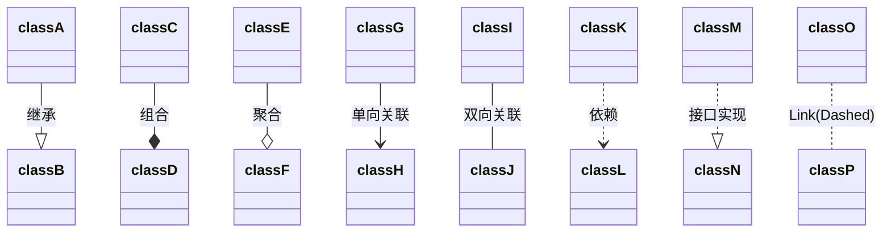

### 1、类的表示方式

UML类图使用包含类名、属性(field)和方法(method)且带有分割线的矩形来表示

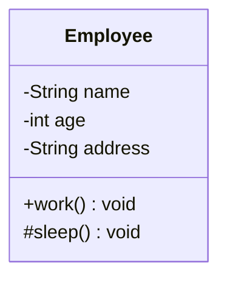

属性、方法名前加"+"、"-"和"#"表示可见性，UML类图中表示可见性的符号有三种：

- +：表示public
- -：表示private
- \#：protected

备注：什么都不加表示default

### 2、类与类之间的关系

#### a、关联关系

对象间的一种引用关系，用于表示一类对象与另一类对象之间的联系，一般以成员属性的形式体现。分为一般关联关系、聚合关系和组合关系

- 一般关联关系
    - 单向关联  
      **用一个带实心箭头的实线表示**
  ```mermaid
  classDiagram
    Address <-- Customer
    Customer: -Address address 
  ```
    - 双向关联  
      双方各自持有对方类型的成员变量，使用**一条不带任何箭头的直线表示**
  ```mermaid
  classDiagram
  Customer -- Product
  class Customer {
    -List~product~ products
  }
  class Product {
    -Customer customer
  }
  ```
    - 自关联
      **使用一条带有箭头且指向自身的线表示**
  ```mermaid
  classDiagram
  Node --> Node
  Node: -Node next
  ```
- 聚合关系  
  聚合关系是关联关系的一种，是强关联关系，是整体与部分之间的关系，但是部分可脱离整体对象而独立存在。
  **用带空心菱形的实线来表示，菱形指向整体**

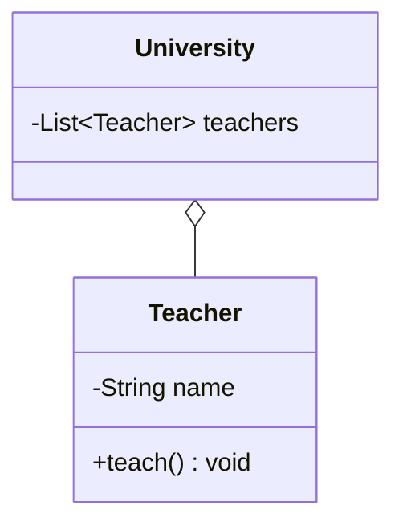

- 组合关系  
  组合关系也表示整体与部分之间的关系，但是是一种更强烈的聚合关系——组合关系中，整体对象可以控制部分对象的生命周期，一旦整体对象不存在，部分对象也将不存在，部分对象不能脱离整体对象而存在  
  **用带空心菱形的实线来表示，菱形指向整体**

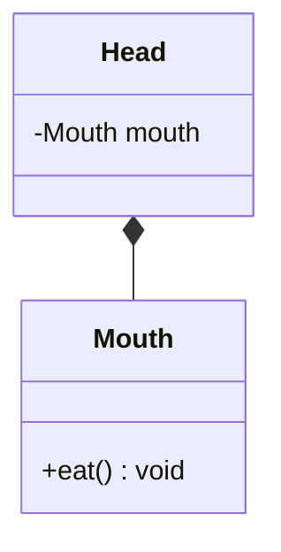

#### b、依赖关系

依赖关系是一种使用关系，是对象之间耦合度最弱的一种关联关系，是临时性的关联。具体表现：某个类的方法通过局部变量、方法的参数或者对静态方法的调用来访问另一个类（被依赖的类）中的某些方法来完成一些职责  
**使用带箭头的虚线来表示，箭头从使用类指向被依赖的类**

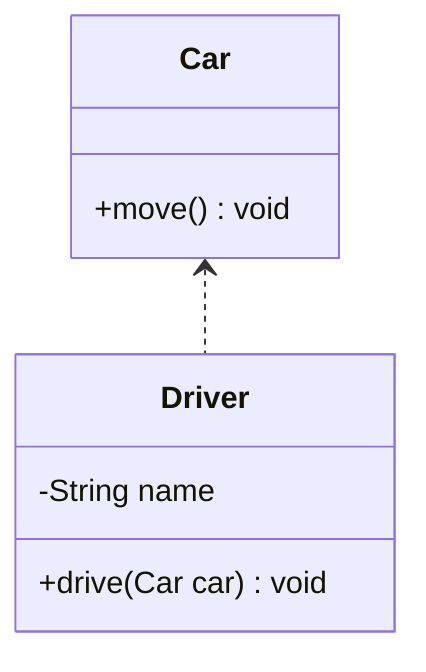

#### c、继承关系

继承关系是对象之间耦合度最大的一种关系，表示一般与特殊的关系，是父类与子类之间的关系，是一种继承关系（也称为泛化关系）  
**用带空心三角箭头的实线来表示**，箭头从子类指向父类

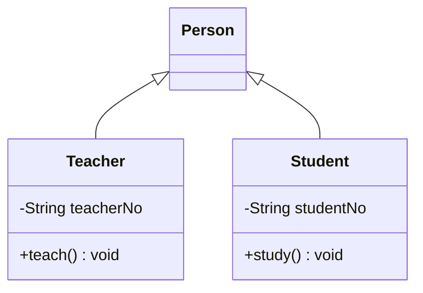

#### d、实现关系

实现关系是接口与实现类之间的关系。类实现了接口，类中的操作实现了接口中所声明的所有抽象操作  
**用带空心三角箭头的虚线来表示**，箭头从实现类指向接口

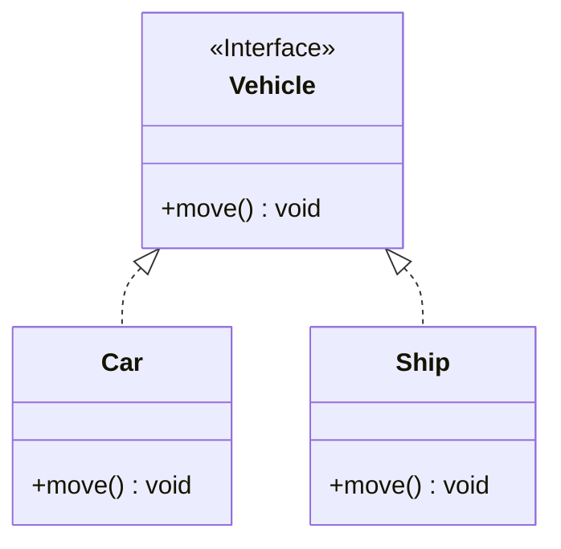

## 二、软件设计原则

### 1、开闭原则

**对修改关闭，对扩展开放**  
在程序需要进行扩展时，不能修改原有的代码，实现一个热插拔的效果。简言之，是为了使程序的扩展性好，易于维护和升级。 最常见的就是定义接口（或抽象类），使用子类实现（或继承）来扩展功能。举例：搜狗输入法皮肤案例

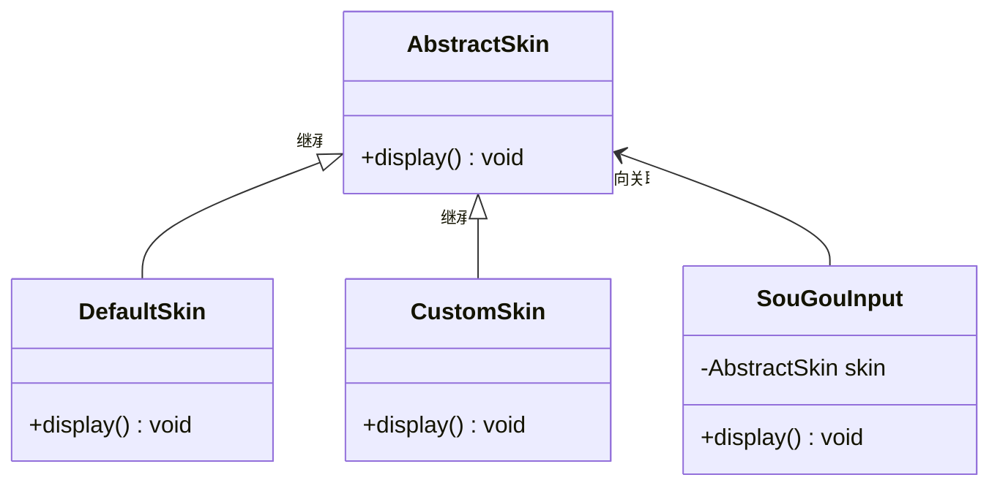

``` java
/**
 * @author ZhangTao
 * @date 2022/6/21
 * @desc 抽象皮肤类
 */
public abstract class AbstractSkin {

    /**
     * 显示的方法
     */
    public abstract void display();

}
```

``` java
/**
 * @author ZhangTao
 * @date 2022/6/21
 * @desc 自定义皮肤
 */
public class CustomSkin extends AbstractSkin {

    @Override
    public void display() {
        System.out.println("自定义皮肤实现...");
    }
}
```

``` java
/**
 * @author ZhangTao
 * @date 2022/6/21
 * @desc 默认皮肤类
 */
public class DefaultSkin extends AbstractSkin {

    @Override
    public void display() {
        System.out.println("默认皮肤实现...");
    }
}
```

``` java
/**
 * @author ZhangTao
 * @date 2022/6/21
 * @desc 搜狗输入法皮肤类
 */
public class SouGouInput {

    private AbstractSkin skin;

    /**
     * 显示方法
     */
    public void display() {
        skin.display();
    }

}
```

```java
public class SkinClient {

    public static void main(String[] args) {
        // 1、创建搜狗输入法对象
        SouGouInput input = new SouGouInput();

        // 2、创建皮肤对象
        // DefaultSkin skin = new DefaultSkin();
        CustomSkin skin = new CustomSkin();

        // 3、设置皮肤对象到输入法
        input.setSkin(skin);

        // 4、显示皮肤
        input.display();
    }

}
```

### 2、里氏代换原则

任何基类可以出现的地方，子类一定可以出现  
通俗理解：子类可以扩展父类的功能，但不能改变父类原有的功能，即子类继承父类时，除添加新方法完成新功能外，尽量不要重写父类方法。  
**经典案例：** 正方形不是长方形

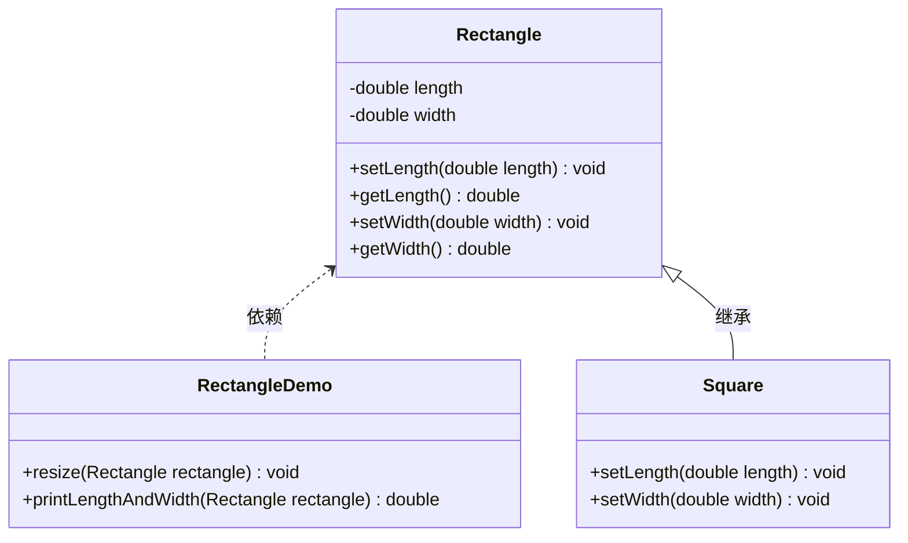

```java
public class Rectangle {

    private double length;

    private double width;

    public double getLength() {
        return length;
    }

    public void setLength(double length) {
        this.length = length;
    }

    public double getWidth() {
        return width;
    }

    public void setWidth(double width) {
        this.width = width;
    }
}
```

```java
public class Square extends Rectangle {

    @Override
    public void setLength(double length) {
        super.setLength(length);
        super.setWidth(length);
    }

    @Override
    public void setWidth(double width) {
        super.setWidth(width);
        super.setLength(width);
    }
}
```

```java
public class RectangleDemo {

    public static void main(String[] args) {
        Rectangle rectangle = new Rectangle();
        rectangle.setLength(20);
        rectangle.setWidth(10);
        resize(rectangle);
        printLengthAndWidth(rectangle);

        System.out.println("=============================");

        Square square = new Square();
        square.setLength(10);
        resize(square); // 死循环
        printLengthAndWidth(rectangle);
    }

    /**
     * 扩宽方法
     *
     * @param rectangle 长方形
     */
    public static void resize(Rectangle rectangle) {
        // 判断宽如果比长小，进行扩宽工作
        while (rectangle.getWidth() <= rectangle.getLength()) {
            rectangle.setWidth(rectangle.getWidth() + 1);
        }
    }

    public static void printLengthAndWidth(Rectangle rectangle) {
        System.out.printf("长方形的长=%s, 宽=%s%n", rectangle.getLength(), rectangle.getWidth());
    }

}
```

resize方法并不适合正方形，因为会产生死循环。 => resize方法中，Rectangle类型的参数不能被Square类型的参数代替，如果进行了替换就得不到预期结果。 因此，Square类和Rectangle类之间的继承关系违反了里氏代换原则，他们之间的继承关系不成立，即正方形不是长方形。  
因此需要重新设计它们之间的关系，抽象出一个四边形接口，让它们去实现这个接口

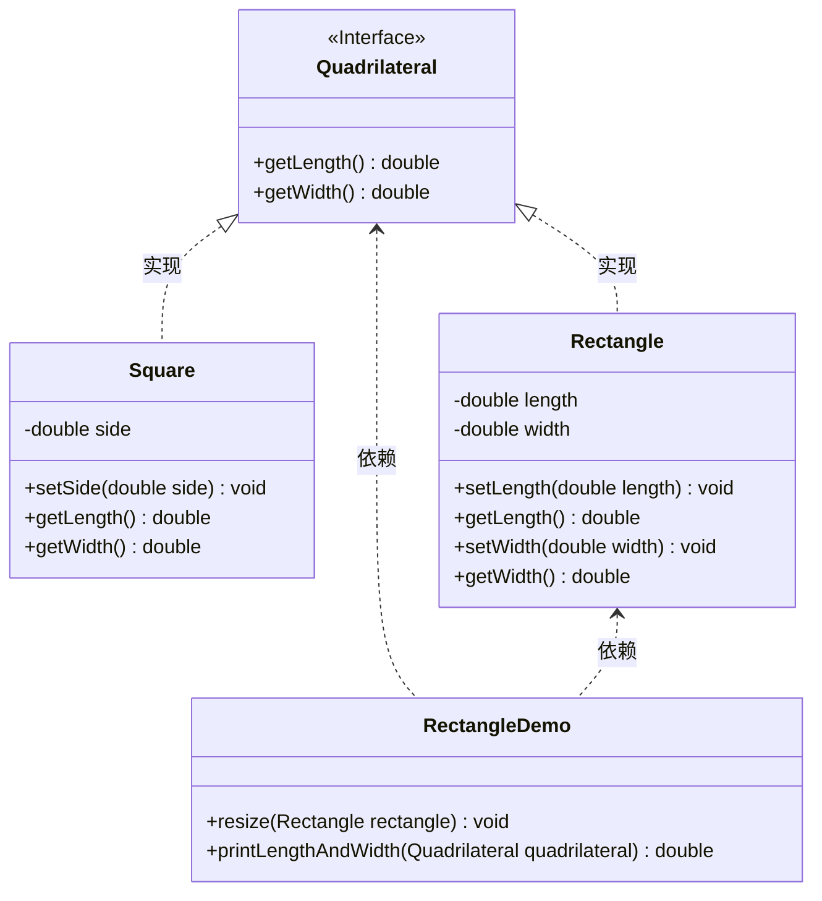

```java
public interface Quadrilateral {

    double getLength();

    double getWidth();

}
```

```java
public class Rectangle implements Quadrilateral {

    private double length;

    private double width;

    @Override
    public double getLength() {
        return this.length;
    }

    @Override
    public double getWidth() {
        return this.width;
    }

    public void setWidth(double width) {
        this.width = width;
    }

    public void setLength(double length) {
        this.length = length;
    }

}
```

```java
public class Square implements Quadrilateral {

    private double size;

    @Override
    public double getLength() {
        return this.size;
    }

    @Override
    public double getWidth() {
        return this.size;
    }

    public void setSize(double size) {
        this.size = size;
    }
}
```

```java
public class RectangleDemo {

    public static void main(String[] args) {
        Rectangle rectangle = new Rectangle();
        rectangle.setLength(20);
        rectangle.setWidth(10);
        resize(rectangle);
        printLengthAndWidth(rectangle);

        System.out.println("=============================");

        Square square = new Square();
        square.setSize(10);
        // resize(square); // 无法编译，解决了“违反里氏代换原则”的问题
        printLengthAndWidth(rectangle);
    }

    public static void resize(Rectangle rectangle) {
        // 判断宽如果比长小，进行扩宽工作
        while (rectangle.getWidth() <= rectangle.getLength()) {
            rectangle.setWidth(rectangle.getWidth() + 1);
        }
    }

    public static void printLengthAndWidth(Quadrilateral quadrilateral) {
        System.out.printf("四边方形的长=%s, 宽=%s%n", quadrilateral.getLength(), quadrilateral.getWidth());
    }

}
```

### 3、依赖倒转原则

**高层模块不应该依赖低层模块，两者都应该依赖其抽象；抽象不应该依赖细节，细节应该依赖抽象**  
简单地说，就是要求对抽象进行编程，不要对实现进行编程，这样就降低了客户与实现模块之间的耦合。事实上**依赖倒转原则**是开闭原则的具体实现

**案例：** 组装电脑

优化前：

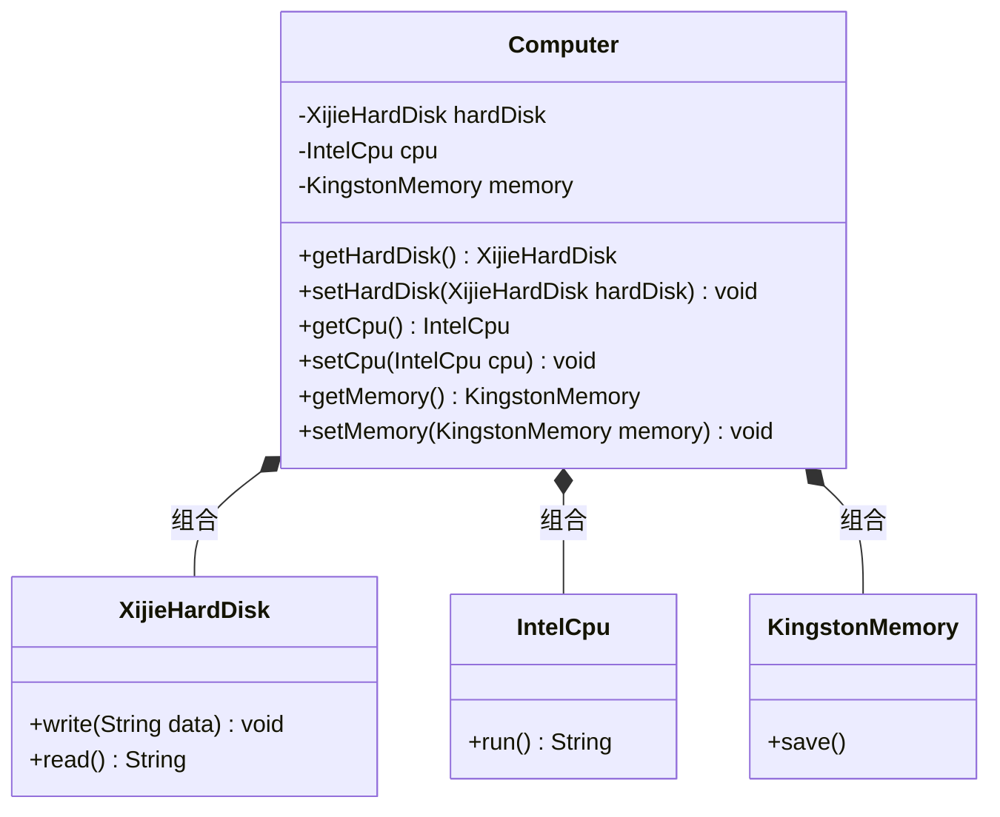

硬盘、CPU和内存的类型都写死了，要想更换必须修改源码，违反了开闭原则

优化后：

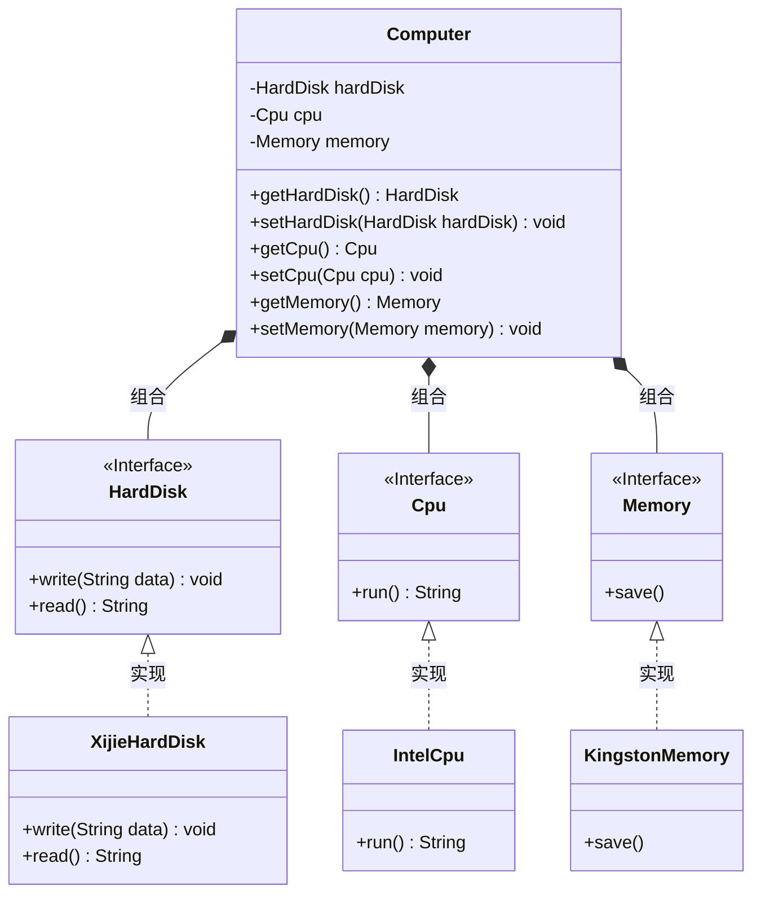

### 4、接口隔离原则

**客户端不应该被迫依赖于他不使用的方法，即一个类对另一个类的依赖应该建立在最小的接口上**

举例：A品牌的安全门具有防火、防水和防盗的功能，可以将防火、防水和防盗功能提取成一个接口，形成一套规范

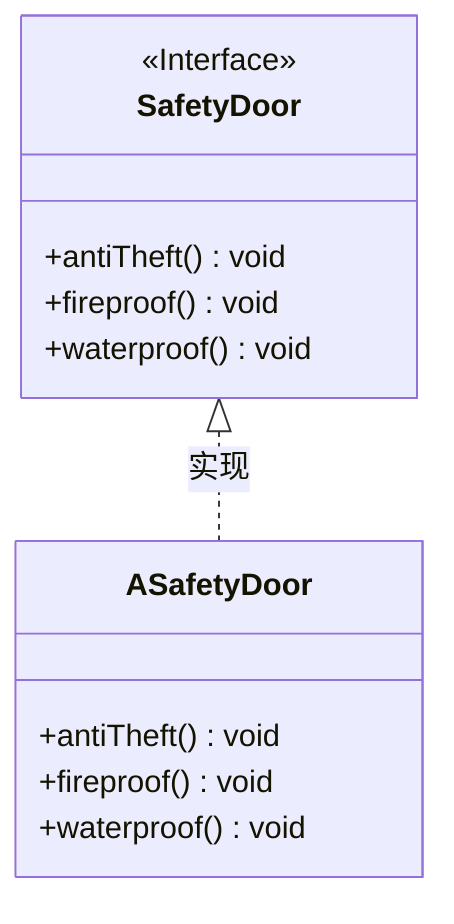

这样设计存在的问题是，假如需要再设计B品牌的安全门，而B品牌的安全们只有防水、防盗功能，如果此时实现SafetyDoor接口，就不得不实现“防火”这一不应该实现的方法，这就违反了“接口隔离原则”

**优化：根据功能将接口拆分成小接口**

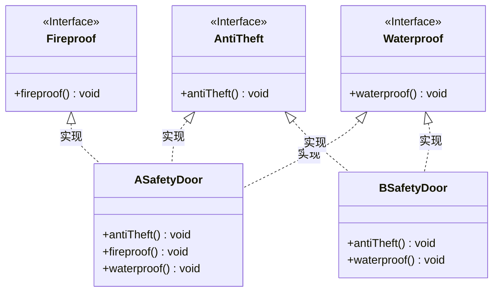

### 5、迪米特法则

迪米特法则又叫最小知识原则：只和你的直接朋友交谈，不跟”陌生人“说话

其含义是：如果两个软件实体无需直接通信，那么就不应该发生直接的相互调用，可以通过第三方转发该调用。其目的是降低类之间的耦合，提高模块的相对独立性。

举例：明星与经纪人的关系实例

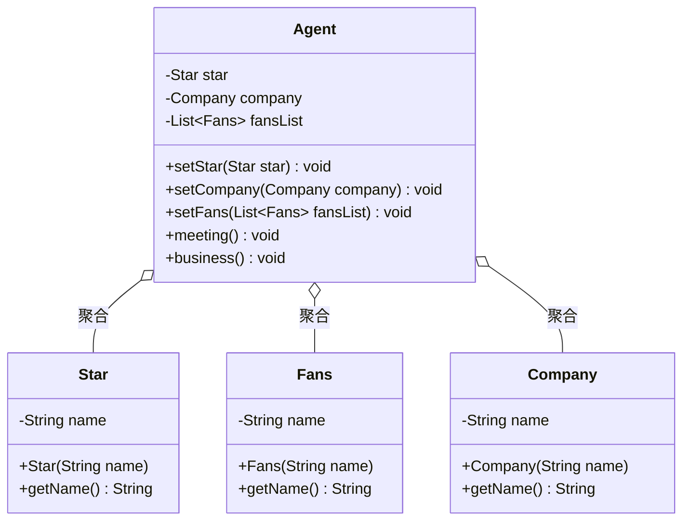

### 6、合成复用原则

尽量先使用组合或者聚合等关联关系来实现，其次才考虑使用继承关系来实现

通常类的复用分为继承复用和合成复用两种。继承复用虽然有简单和易实现的优点，但也存在以下缺点：

1. 破坏了类的封装性。因为继承会将父类的实现细节暴露给子类，父类对子类是透明的，所以这种复用又称为“白箱”复用
2. 子类与父类的耦合度高。父类的实现的任何改变都会导致子类的实现发生变化，这不利于类的扩展与维护
3. 限制了复用的灵活性。从父类继承而来的实现是静态的，在编译时已经定义，所以在运行期不可能发生变化

采用组合和聚合复用时，可以将已有对象纳入新对象中，使之成为新对象的一部分，新对象可以调用已有对象的功能，它有以下优点：

1. 它维持了类的封装性。因为成分对象的内部细节是新对象看不见的，所以这种复用又称为“黑箱”复用
2. 对象间的耦合度低，可以在类的成员位置声明对象
3. 复用的灵活性高。这种复用可以在运行时动态进行，新对象可以动态地引用与成分对象类型相同的对象（如子类）

举例：汽车分类管理程序 汽车按“动力源”划分可分为汽油汽车、电动汽车；按“颜色”划分可分为白色汽车、黑色汽车和红色汽车等。如果同时考虑这两种分类，其组合就很多。

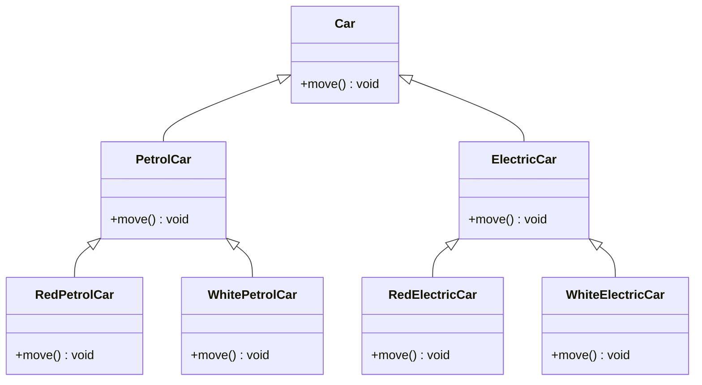

从以上类图可以看出使用继承复用产生了很多子类，如果现在又有新的动力源或者新的颜色的化，就需要再定义新的类，我们试着将继承复用改成聚合复用

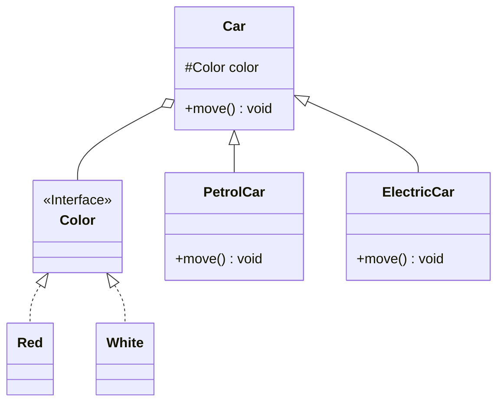

## 三、设计模式

### 1. **创建者模式**（5种）

用于描述怎样创建对象，主要特点是：将对象的创建与使用分离，使用者不需要关注对象的创建细节，这样可以降低系统的耦合度

- **单例模式**

    这种模式涉及到一个单一的类，该类负责创建自己的对象，同时确保只有单个对象被创建，这个类提供了一种访问其唯一对象的方式，可以直接访问，不需要实例化该类的对象。分为饿汉式和懒汉式两种：
    - 饿汉式：类加载就会导致该单例对象被创建
    - 懒汉式：类加载不会导致该单例对象被创建，而是首次使用该对象时才会创建

    除了枚举方式实现的单例模式，其他的实现方式通过序列化和反射（反射调用构造方法）这两种手段均可以破坏单例

- **原型模式**
- **工厂方法模式**
- **抽象工厂模式**
- **建造者模式**

### 2. **结构型模式**（7种）

用于描述如何将类或对象按某种布局组成更大的结构 - **代理模式**

- **适配器模式**
- **桥接模式**
- **装饰者模式**
- **外观模式**
- **享元模式**
- **组合模式**

### 3. **行为型模式**（11种）

用于描述类或对象之间怎样相互协作，共同完成单个对象无法单独完成的任务，以及怎样分配职责

- **模板方法模式**
- **策略模式**
- **命令模式**
- **责任链模式**
- **状态模式**
- **观察者模式**
- **中介者模式**
- **迭代器模式**
- **访问者模式**
- **备忘录模式**
- **解释器模式**